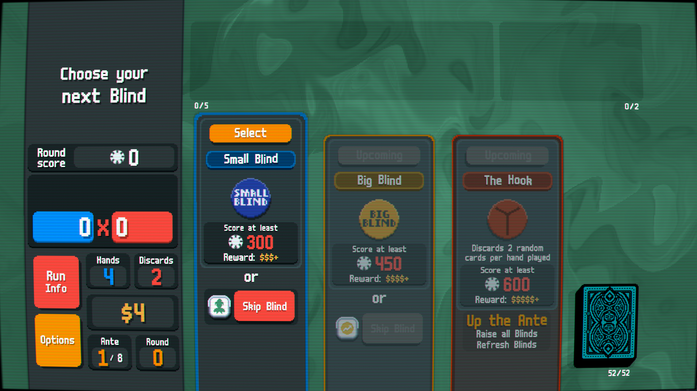
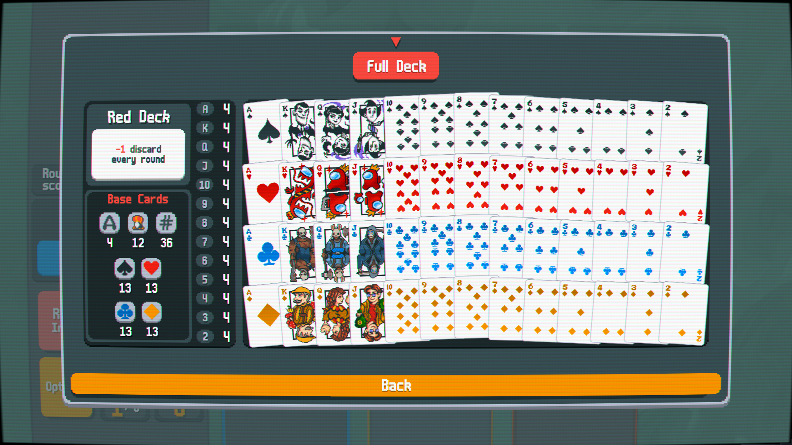
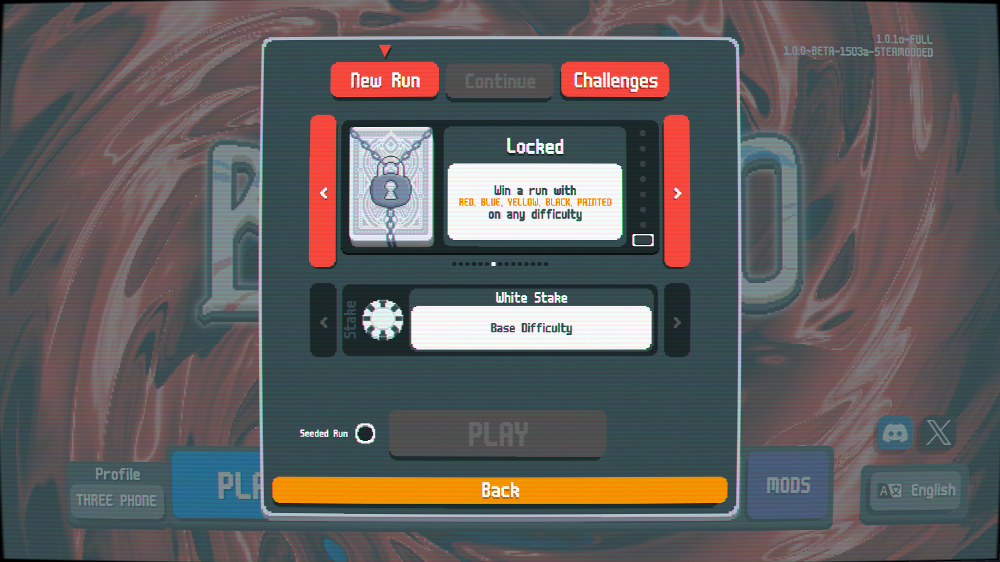
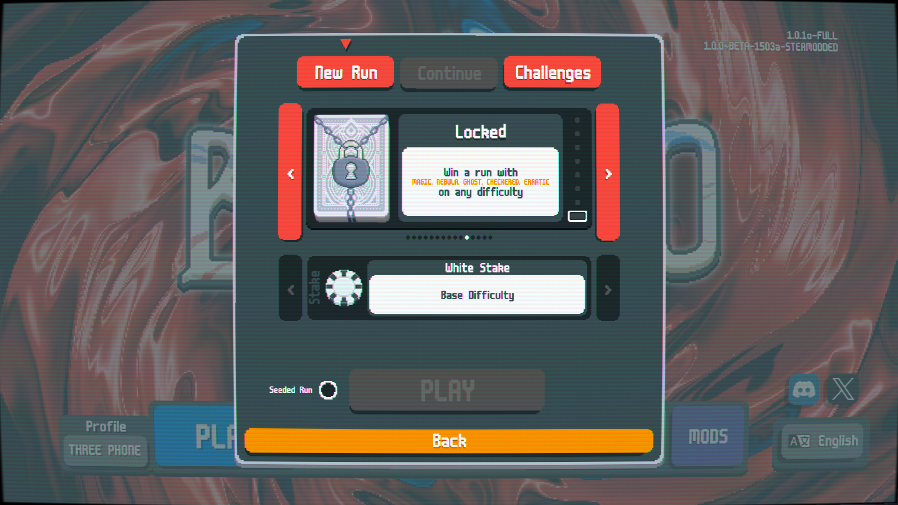

# Deck Inversion Challenge Konfiguretion

## In The Beginning
Deck Inversion Challenge Konfigureation aims to solve the question that has been plaguing our ancestors for years... "What if we took all of the decks in Balatro and inversed their effects?". For centuries, man has been working to achieve this quaint goal. Inventions such as Electricity, Poker, The Computer, and Balatro itself have all been made in pursuit of this goal. But only one being, one singular green monkey had what it took to take all of the effects of the decks in Balatro and inverse them! It took hard work and dedication, but finally after HOURS of work the vision has been achieved! AND NOW you can get your hands on it by just downloading the zip file!!!!!

## Purpose
The goal of this was to bring a silly idea from a friend to life, but as the project evolved, it became about trying to capture some of the magic of playing Balatro for the first time! For this reason, I would suggest playing for the first time on a new account with nothing unlocked. I have separated the unlocks in this mod to be in 3 sections, requiring the completion of the previous 5 decks to unlock the next 5. I'm considering changing this to 4/5 in the previous region, but this can give you the time to think about how the remaining decks may have been "inverted". We took a lot of creative liberty in what "inverse" meant in some cases and I hope you get a good chuckle out of them!

## Warning
Note that if you play with your main account and beat a deck/stake for the first time, it will count towards the non-inversed version of the deck on that account when you load up the game again. 

## Requirements (will add versions required later)
* Balatro 
* Steamodded
* Lovely Injector

## Installation
* Click on the "Releases" current release and download the .zip file
* Extract the parent folder into the ../Mods path (Windows is %AppData%/Balatro/Mods but more information exists in the Steamodded release)
* Launch Balatro and watch DICK get injected into your game!

## Known Issues
I am very new to this whole "modding" stuff and therefore I have created some issues that you may run into:

* There are likely to be some issues with text not showing up (specifically on the locked decks) due to me writing this in a bad way without some of the proper precautions taken, and this issue will be fixed in a future patch
* There are a few times where I injected something that hijacked the functionality of the game, and therefore in running this mod with other mods, expect some wierd functionality on some things relating to scoring, unlocks, or pack items at times

Likely there are more issues then the ones on this list and I plan to add things here as I notice them and they are being worked on currently

## Colaboration
If you are a super smart humanoid, then feel free to submit PRs for features you want to add and I will review and merge these updates ASAP! 

## Special Thanks To

[@AdamBennett](https://github.com/adambennett) : Creator of the Custom Deck Creation Tool
 Used your inverted assets for the decks! A few creative ideas were sparked by your deck creator mod so thank you very much for your mod please go check it out!
squirpydirtle : GOAT, Playtester, and Ideas guy
[@DeveloperRowan](https://github.com/developerrowan) : Creator of the [Amplified Screen Shake](https://github.com/developerrowan/AmplifiedScreenShake) Mod and Playtester

## Screenshots
Im going to only show early content of this mod as to not spoil but continue at your own risk...

